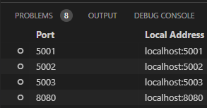

# What is this project about?

In this project we have set up private p2p network taking advantage of [InterPlanetary File System IPFS][1].

Client nodes in the network are able to find themselves over the internet using the bootstrap server. After clients have found other clients, bootstrap server it is not necessary anymore and clients can communicate directly with each other.

Project represents a system where there are nodes that want to occasionally share some files with each other, but keep network restricted only the nodes that have the key for the network.

We experimented with multiple network setups with Docker networking. However, we did not get the bootstrapping to work in a network where the client nodes were isolated. In this project the client nodes are running on the same local network, in which the bootstrap nodes are not needed to discover peers. We decided to include the bootstrap nodes in this setup anyway to demonstrate the structure of the network in an actual use-case.

# How to run the system

1. Run `run.sh`
2. Access the IPFS web UI in address `localhost:5001/webui`

[Port forwarding]:#port-forwarding

You are ready to transfer files between the nodes and create directories to your private network.

If you want to access other nodes with web UI go to Settings page and change the port matching the port of the node.


# About project files
`cleanup.sh` is script which clears and creates the folders for local data of IPFS nodes.

`10import-webui.sh`, `20clean-bootstrap.sh` and `30log-bootstrap.sh` are a configuration scripts for the IPFS nodes.

`swarm.key` is the private key that the nodes authenticate itself to private network.

# How to set up development environment

To be able to run the project you must have Docker and Docker Compose installed. Follow the installation guide in Docker documentation: https://docs.docker.com/engine/

Reboot your system after install.

## Option: VM + Docker

Option is to run the Docker in virtual machine. You can automate the creation of virtual machine with Vagrant. You need to install [VirtualBox][2] for virtual machines and [Vagrant][3] for automation.

Setup tested with:
 - Vagrant 2.3.4
 - VirtualBox 6.1.40

Install virtualbox guest additions plugin to enable automatic installation of virtualbox guest additions:

```console
vagrant plugin install vagrant-vbguest
```

Clone repository to some folder or copy the Vagrantfile and bootstrap.sh into folder. Open terminal in same folder and run `vagrant up`. Vagrant will set up the environment for you.

You can ssh to virtual machine with `vagrant ssh` or export the ssh profile with `vagrant ssh-config` and save it to your `~./ssh/config` and use your preferred tools to connect to VM.

### Port forwarding

If using VSCode you can use integrated port forwarding. Otherwise you need to forward the ports from the VM.



<!-- References -->
[1]: https://ipfs.tech/
[2]: https://www.virtualbox.org/
[3]: https://www.vagrantup.com/
